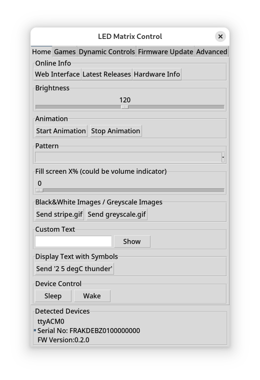

# Framework Laptop 16 - Input Module Firmware/Software

This repository contains both the firmware for the Framework Laptop 16 input modules,
as well as the tool to control them.

Rust firmware project setup based off of: https://github.com/rp-rs/rp2040-project-template

## Modules

See pages of the individual modules for details about how they work and how
they're controlled.

- [LED Matrix](ledmatrix/README.md)
- [Minimal C1 Input Module](c1minimal/README.md)
- [2nd Display](b1display/README.md)
- [QT PY RP2040](qtpy/README.md)

## Generic Features

All modules are built with an RP2040 microcontroller
Features that all modules share

- Firmware written in bare-metal Rust
- Reset into RP2040 bootloader when firmware crashes/panics
- Sleep Mode to save power
- API over USB ACM Serial Port - Requires no Drivers on Windows and Linux
  - Go to sleep
  - Reset into bootloader
  - Control and read module state (brightness, displayed image, ...)

## Control from the host

To build your own application see the: [API command documentation](commands.md)

Or use our `inputmodule-control` app, which you can download from the latest
[GH Actions](https://github.com/FrameworkComputer/inputmodule-rs/actions) run or
the [release page](https://github.com/FrameworkComputer/inputmodule-rs/releases).

For device specific commands, see their individual documentation pages.

### GUI and Python
There are also a python library and GUI tool. See their [README](python/README.md).



###### Permissions on Linux
To ensure that the input module's port is accessible, install the `udev` rule and trigger a reload:

```sh
sudo cp release/50-framework-inputmodule.rules /etc/udev/rules.d/
sudo udevadm control --reload && sudo udevadm trigger
```

##### Common commands:

###### Listing available devices

```sh
> inputmodule-control --list
/dev/ttyACM0
  VID     0x32AC
  PID     0x0020
  SN      FRAKDEAM0020110001
  Product LED_Matrix
/dev/ttyACM1
  VID     0x32AC
  PID     0x0021
  SN      FRAKDEAM0000000000
  Product B1_Display
```

###### Apply command to single device

By default a command will be sent to all devices that can be found, to apply it
to a single device, specify the COM port.
In this example the command is targeted at `b1-display`, so it will only apply
to this module type.

```sh
# Example on Linux
> inputmodule-control --serial-dev /dev/ttyACM0 b1-display --pattern black

# Example on Windows
> inputmodule-control.exe --serial-dev COM5 b1-display --pattern black
```

###### Send command when device connects

By default the app tries to connect with the device and aborts if it can't
connect. But you might want to start the app, have it wait until the device is
connected and then send the command.

```
> inputmodule-control b1-display --pattern black
Failed to find serial device. Please manually specify with --serial-dev

# No failure, waits until the device is connected, sends command and exits
> inputmodule-control --wait-for-device b1-display --pattern black

# If the device is already connected, it does nothing, just wait 1s.
# This means you can run this command by a system service and restart it when
# it finishes. Then it will only ever do anything if the device reconnects.
> inputmodule-control --wait-for-device b1-display --pattern black
Device already present. No need to wait. Not executing command.
```

## Update the Firmware

First, put the module into bootloader mode.

This can be done either by pressing the bootsel button while plugging it in or
by using one of the following commands:

```sh
inputmodule-control led-matrix --bootloader
inputmodule-control b1-display --bootloader
inputmodule-control c1-minimal --bootloader
```

Then the module will present itself in the same way as a USB thumb drive.
Copy the UF2 firmware file onto it and the device will flash and reset automatically.
Alternatively when building from source, run one of the following commands:

```sh
cargo run -p ledmatrix
cargo run -p b1display
cargo run -p c1minimal
```

## Building the firmware

Dependencies: [Rust/rustup](https://rustup.rs/), pkg-config, libudev

Prepare Rust toolchain (once):

```sh
rustup target install thumbv6m-none-eabi
cargo install flip-link --locked
cargo install cargo-make --locked
cargo install elf2uf2-rs --locked
```

Build:

```sh
cargo make --cwd ledmatrix
cargo make --cwd b1display
cargo make --cwd c1minimal
```

Generate the UF2 update file into `target/thumbv6m-none-eabi/release/`:

```sh
cargo make --cwd ledmatrix uf2
cargo make --cwd b1display uf2
cargo make --cwd c1minimal uf2
```

## Building the Application

Dependencies: [Rust/rustup](https://rustup.rs/), pkg-config, libudev

Currently have to specify the build target because it's not possible to specify a per package build target.
Tracking issue: https://github.com/rust-lang/cargo/issues/9406

```sh
# Install cargo-make to help build it
cargo install cargo-make --locked

# Build it
> cargo make --cwd inputmodule-control

# Build and run it, showing the tool version
> cargo make --cwd inputmodule-control run -- --version
```

### Check the firmware version of the device

###### In-band using commandline

```sh
> inputmodule-control led-matrix --version
Device Version: 0.2.0
```

###### By looking at the USB descriptor

On Linux:

```sh
> lsusb -d 32ac: -v 2> /dev/null | grep -P 'ID 32ac|bcdDevice'
Bus 003 Device 078: ID 32ac:0021 Framework Laptop 16 B1 Display
  bcdDevice            0.10
```

## Rust Panic

When the Rust code panics, the RP2040 resets itself into bootloader mode.
This means a new firmware can be written to overwrite the old one.

Additionally the panic message is written to XIP RAM, which can be read with [picotool](https://github.com/raspberrypi/picotool):

```sh
sudo picotool save -r 0x15000000 0x15004000 message.bin
strings message.bin | head
```
